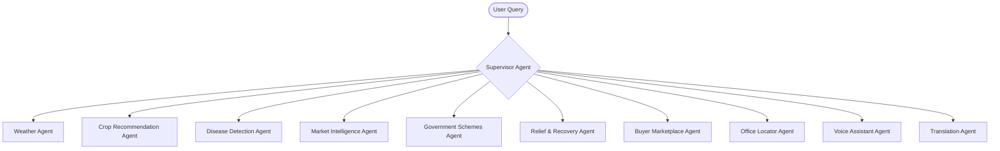

# 🌾 Kisan Alert AI – Master Knowledge File

## Project Vision

Kisan Alert AI is an AI-powered digital farming companion built for small and marginal farmers. It is not just an agricultural application, but a complete farming ecosystem that helps farmers from planning to selling and disaster recovery.

**Primary Objective:**
Reduce crop losses, improve farmer income, and increase accessibility through advanced AI, multilingual support, and a voice-first interaction model.

---

# Goal

Help small and marginal farmers make better farming decisions using Artificial Intelligence.

The application provides:
* **AI Crop Recommendation** (Gemini reasoning, soil and weather analysis)
* **AI Disease Detection** (foliage camera scans and treatment advice)
* **Kisan Mitra AI** (central speech-first conversational assistant)
* **Weather Intelligence & Dry Spell Alerts** (agricultural forecast integrations)
* **Irrigation & Fertilizer Guidance**
* **Government Schemes Advisor** (personalized eligibility checkers)
* **Market Intelligence & Price Forecasts** (APMC Mandi spot prices)
* **Premium B2B Buyer Marketplace** (direct-to-buyer sales, eliminating middle-men)
* **Farmer Relief & Recovery Hub** (emergency damage assessor, NGO support, and alternative buyers)
* **Rythu Seva Kendra Office Locator** (with maps and appointment slot booking)

---

# Product Philosophy

* **Designed for Low Digital Literacy:** Minimize keyboard input. Farmers should not have to type long forms.
* **Voice-First Workflows:** Every major workflow and navigation route must be completely accessible via natural language speech.
* **Simplicity Over Complexity:** Every recommendation must be highly visual, simple, and immediately understandable. Accessibility always takes precedence over feature complexity.

---

# Voice-First Experience

Voice interaction is the core interface of the platform.
Users can completely navigate the application by speaking natural language queries, such as:
* *"Recommend crops"*
* *"Open weather"*
* *"Show market prices"*
* *"Scan my crop"*
* *"Find nearby agriculture office"*
* *"Government schemes"*

The AI understands contextual natural intent rather than hardcoded predefined command strings.

---

# AI Farming Companion: "Kisan Mitra AI"

The central core of the platform is **Kisan Mitra AI**, a permanent, helper persona representing a trusted digital agronomist.

**Key Responsibilities:**
* Answer agricultural, weather, and market questions
* Navigate the user to different parts of the application
* Explain what is displayed on the current screen
* Guide users step-by-step through form completion using voice prompts
* Read AI recommendations and guides aloud
* Guide elderly or digitally illiterate farmers
* Explain government schemes and application processes
* Interpret market price movements and sell/hold recommendations
* Connect users to Rythu Seva Kendras (RSK) and support services

---

# Multilingual Support

The entire application supports real-time translation and voice output across 11 major Indian languages:
* English
* Telugu (తెలుగు)
* Hindi (हिन्दी)
* Tamil (தமிழ்)
* Kannada (ಕನ್ನಡ)
* Marathi (मराठी)
* Gujarati (ગુજરાતી)
* Punjabi (ਪੰਜਾਬੀ)
* Malayalam (മലയാളം)
* Odia (ଓଡ଼ିଆ)
* Bengali (বাংলা)

**Integrations Stack:**
* **Gemini Translation & Google Cloud Translation API** for dynamic layout localization.
* **Google Cloud Speech-to-Text (STT)** for voice inputs.
* **Google Cloud Text-to-Speech (TTS)** for audio outputs.

---

# Voice Features

* **Voice Search & Navigation:** Speak to search or jump across dashboards.
* **Voice Commands & Form Filling:** Ask questions sequentially (e.g. *"What is your district?"*, *"What crop are you growing?"*) and autofill fields based on speech input.
* **Voice Question Answering:** General agronomist chat.
* **Read Screen Aloud & Speech Playback:** Reads page recommendations when the user taps a speaker icon.
* **Voice Notifications & Help:** Audio alerts for extreme weather or price spikes.
* **Offline Voice Recording:** Cache speech files locally if the network is lost, then sync.

---

# Accessibility & Elder Mode

A toggleable **Elder Mode** optimizes the application for senior or visually impaired farmers:
* Enlarged typography and high-contrast color choices
* Oversized, clear hit targets for buttons and toggles
* Minimalist layouts with minimal text blocks
* Constant voice guidance and audio-first instructions
* Simplified one-tap navigation triggers

---

# AI Smart Greeting

Upon launching the application, Kisan Mitra AI greets the farmer with a personalized audio-visual summary:
> *"Welcome back, Ramesh. Today's weather is favorable for harvesting. Sugarcane prices have increased by 3.6% at Pune Mandi. You have one new pre-approved government subsidy scheme available. How may I help your farm today?"*

---

# Read Aloud & Speaker Icons

Every major recommendation and diagnostic output features a visible speaker icon. Tapping this icon triggers Kisan Mitra AI to explain the contents aloud in the selected language:
* Crop Recommendations
* Disease Diagnoses & Treatment guides
* Weather Forecasts & Advisory warnings
* Mandi Market price indices
* Government subsidy checklists
* Disaster Recovery plans
* RSK Appointment slot confirmations

---

# Emergency Voice Triggers

The assistant immediately recognizes high-priority emergency terms such as *"Help"*, *"Emergency"*, *"My crop is dying"*, *"Flood"*, or *"Drought"*.
Upon detection, the app immediately intercepts the query and opens:
* **Relief & Recovery Hub** (for quick crop scans and damage logs)
* **Nearby Support Offices** (location & directions map)
* **Government Emergency Relief packages**
* **Active Disaster Advisories & emergency contacts**

---

# Offline Mode & Resiliency

To combat poor connectivity in remote fields:
* **Local Caching:** Satellite boundaries, crop data, and pricing indices are stored locally.
* **Voice Queueing:** Speech inputs are recorded and queued locally, automatically syncing back once online.
* **SMS Fallback:** If internet is completely lost, critical weather warnings and buyer notifications are routed via SMS triggers.

---

# UI Guidelines & Design System

All interfaces must follow the existing premium design system:
* **Visual Aesthetic:** Premium white base, clean borders, and emerald green accent styling.
* **Cards & Containers:** Large glassmorphic cards with a border radius of `20px` and soft, clean shadows.
* **Buttons & Inputs:** Consistent `16px` rounding with distinct focus, active, hover, and loading states.
* **Dialog Modals:** Deep curved `24px` border radius.
* **Badges:** Pill-shaped `999px` rounding.
* **Animations:** Framer Motion spring-based translations, fades, scales, and stagger fades. No harsh or dramatic rotating effects.

---

# Development Rules

* **Preserve Completed UI:** Do not modify or redesign completed pages.
* **Component Reuse:** Always check for and reuse existing UI components.
* **Consistent Spacing:** Follow the strict `8px` spacing system (`8px`, `16px`, `24px`, `32px`).
* **Clean Architecture:** Keep layout, routes, business logic, and API calls modular.
* **Next.js App Router Best Practices:** Use standard routing, page components, and Server/Client separation.

---

# Future Google Cloud Integrations

* **Gemini & Vertex AI** (multi-agent reasoning and image recognition)
* **Cloud Speech-to-Text & Text-to-Speech** (multilingual voice interactions)
* **Cloud Translation API** (UI localization)
* **Earth Engine** (satellite crop health mapping and water resource checks)
* **Google Maps Platform** (block-level office coordinates and routing paths)
* **Firebase Authentication & Firestore** (user login and resilient database caches)
* **Google Cloud Run & Cloud Functions** (scalable backend APIs and cron tasks)

---

# Future AI Architecture (LangGraph Multi-Agent System)

The backend agent system is structured as a LangGraph multi-agent network overseen by a Supervisor routing node:

---

# Hackathon Goal

**Primary Objective:** Win the hackathon.
Every design choice, feature addition, and backend integration should directly maximize:
* Innovation index
* Real-world accessibility
* Clear usability for smallholder farmers
* Advanced AI reasoning capabilities (no simple wrappers)
* Practical Google Cloud usage
* Presentation and demo walkthrough quality

Avoid allocating resources to auxiliary development that does not elevate the core presentation value.
